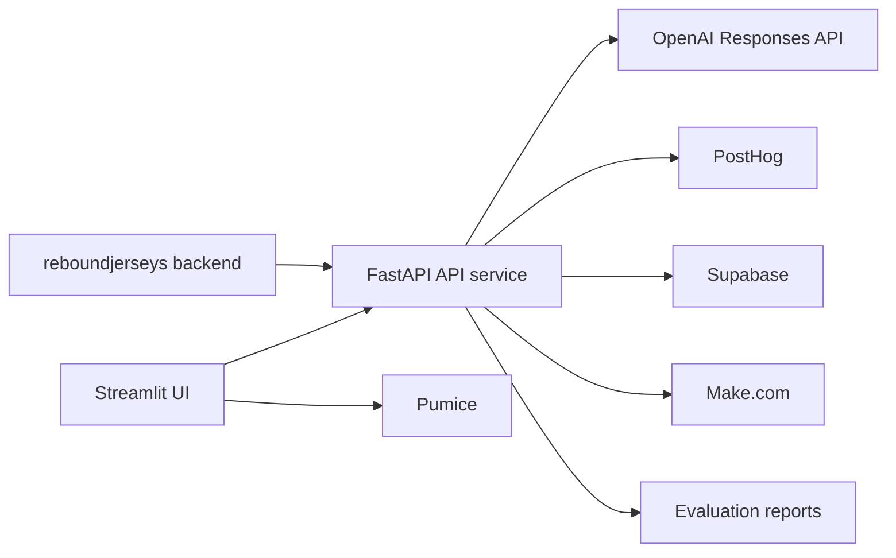

# Architecture

## Repository shape

- `api_service/main.py` owns request orchestration.
- `api_service/extractors/gpt_extractor.py` owns extraction, model detection, palette extraction, multi-jersey detection, and listing insight extraction.
- `api_service/generators/gpt_generator.py` owns title and description generation.
- `ui_service/app.py` is a Streamlit test surface, not the production workflow.
- `evaluation/reports/` stores saved evaluation snapshots.
- `gpt5_upgrade/docs/` stores migration and optimization notes.

## Runtime boundaries

- The repo supports both base64 uploads and OpenAI file IDs.
- `USE_FILE_IDS=true` switches the main workflow to OpenAI Files API.
- `POSTHOG_API_KEY` and `POSTHOG_HOST` enable LLM observability.
- `SUPABASE_URL` and `SUPABASE_SERVICE_ROLE_KEY` enable validation alerts.
- `MAKE_WEBHOOK_URL` enables missing-data webhooks.
- `PUMICE_API_KEY` is only needed for the UI background-removal surface.

## Related platform pages

- [High-level architecture](/high-level-architecture)
- [Service boundaries](/service-boundaries)
- [Integration registry](/engineering-knowledge/integration-registry)
- [Backend APIs](/backend/apis)
