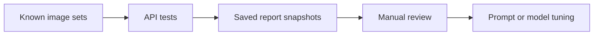

# Evaluations

The scanner uses two quality loops:

- deterministic unit tests for helpers and event tracking
- saved evaluation reports for real image sets

## Saved reports

| Report | Brand | Size | Team | Model | Notes |
| --- | --- | --- | --- | --- | --- |
| `evaluation_report_20250613_223633.txt` | 98.00% | 80.00% | 89.00% | 58.00% | strong brand accuracy, weakest on models |
| `evaluation_report_20250614_110216.txt` | 98.00% | 80.00% | 85.00% | 67.00% | model accuracy improved, team regressed slightly |

## Test coverage

- `api_service/tests/test_openai_response_helper.py` checks Responses API input and retry behavior.
- `api_service/tests/test_listing_consistency.py` checks title and description mismatch detection.
- `api_service/tests/test_posthog_mismatch_tracking.py` checks mismatch-triggered tracking.
- `api_service/tests/test_scanner_responses_migration.py` checks prompt wiring and extractor behavior.

## Evaluation flow

## What the reports say

- Brand extraction is stable.
- Size and model remain the hardest fields.
- Team accuracy moves with prompt changes and model tuning.

## Related pages

- [Observability](/ai-jersey-scanner/observability)
- [Failure modes](/ai-jersey-scanner/failure-modes)
- [Reference](/ai-jersey-scanner/reference)
