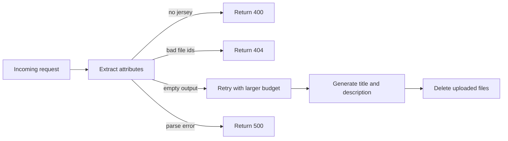

# Failure Modes

## Common failures

| Symptom | Behavior | What to check |
| --- | --- | --- |
| No jersey found | Returns `400` from the image routes | crop, lighting, and source image quality |
| Missing file IDs | Returns `404` from `/process-images/file-ids` | the client upload step and `file_ids` payload |
| Empty OpenAI output | Retries with a larger output budget | model choice, prompt shape, and image detail |
| JSON parse or validation failure | Returns `500` or retries title generation once | response schema and prompt format |
| Supabase unavailable | Skips data validation and alerts | `SUPABASE_URL` and `SUPABASE_SERVICE_ROLE_KEY` |
| Make unavailable | Skips missing-data alerts | `MAKE_WEBHOOK_URL` |
| PostHog unavailable | Uses the base OpenAI client | `POSTHOG_API_KEY` and `POSTHOG_HOST` |
| Cleanup failure | Logs the failure and still ends the request | OpenAI file deletion permissions or transient errors |

## Recovery flow

## Known gap

- `check_if_full_frame` exists as a helper, but the active request path does not enforce it yet.

## Related pages

- [Image pipeline](/ai-jersey-scanner/image-pipeline)
- [Observability](/ai-jersey-scanner/observability)
- [Developer guide](/ai-jersey-scanner/developer-guide)
