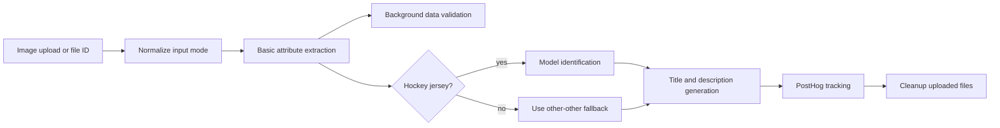

# Image Pipeline

## Routes

- `POST /process-images` accepts multipart uploads and runs the single-jersey workflow.
- `POST /process-images-with-files` accepts multipart uploads, uploads them to OpenAI, then runs the same workflow.
- `POST /process-images/file-ids` accepts pre-uploaded OpenAI file IDs and supports multi-jersey mode.
- `POST /color-palette` returns a representative hex palette.
- `POST /extract-info-listing` extracts insight payloads from listing threads.
- `GET /health` returns the service health check.

## Workflow

## How it behaves

- `extract_basic_info` always runs first.
- Hockey submissions also run jersey model identification.
- Title and description generation runs for every valid jersey.
- `process-images/file-ids` can split a submission into multiple jersey clusters when `multiple_jerseys=true`.
- Uploaded OpenAI files are deleted in a `finally` block after the request finishes.

## Related pages

- [Prompting](/ai-jersey-scanner/prompting)
- [Structured outputs](/ai-jersey-scanner/structured-outputs)
- [Observability](/ai-jersey-scanner/observability)
- [Failure modes](/ai-jersey-scanner/failure-modes)
