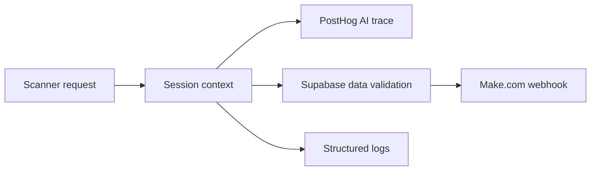

# Observability

The scanner combines request tracing, application events, and data-quality alerts.

## What gets tracked

- Session IDs and session paths via `GPT_CLIENT_INSTANCE.set_session_context`
- PostHog distinct IDs when callers provide them
- `jersey_attributes_identified`
- `jersey_title_description_generated`
- `$ai_generation` when title or description output mismatches extracted attributes
- Missing brand, league, and team alerts via Make.com
- Structured logs for session start, cleanup, retries, and validation failures

## Flow

## Health

- `GET /health` returns a minimal service health response.
- If PostHog is unavailable, the scanner falls back to the base OpenAI client.
- If Supabase credentials are missing, data validation is skipped.
- If the Make webhook is missing, alerting is skipped.

## Related pages

- [Evaluations](/ai-jersey-scanner/evaluations)
- [Failure modes](/ai-jersey-scanner/failure-modes)
- [Backend integrations](/backend/integrations)
