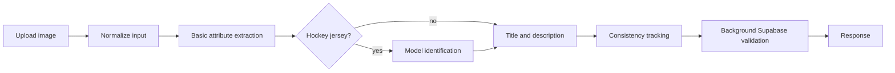

# Scanner Pipeline

## Primary image workflow

1. Image upload enters through `POST /process-images`, `POST /process-images/file-ids`, or `POST /process-images-with-files`.
2. Input is normalized as either a base64 data URI or an OpenAI Files API file ID.
3. Basic jersey attributes are extracted through the model layer.
4. Hockey-only model identification runs when the input calls for it.
5. The service generates the title and description payload.
6. PostHog records consistency signals when configured.
7. Background validation checks platform data through Supabase-related workflows.
8. File ID flows clean up uploaded files after request handling.

## Multi-jersey workflow

1. Detect whether the frame contains more than one jersey.
2. Split the image set into clusters.
3. Run the per-cluster workflow in parallel.
4. Return one result object per successful cluster.

## Ancillary workflows

- `/color-palette`
  - uploads images
  - extracts dominant hex colors
- `/extract-info-listing`
  - extracts listing, user, comment, brand, and model insights
- `/health`
  - returns service health

## Failure and cleanup points

- OpenAI file IDs are deleted after file-id flows finish.
- The response helper retries empty outputs with a larger token budget and lower reasoning effort.
- Validation errors stay isolated from the main response path.

## See also

- [AI Jersey Scanner](/ai-jersey-scanner)
- [Prompting](/ai-jersey-scanner/prompting)
- [Vision models](/ai-jersey-scanner/vision-models)
