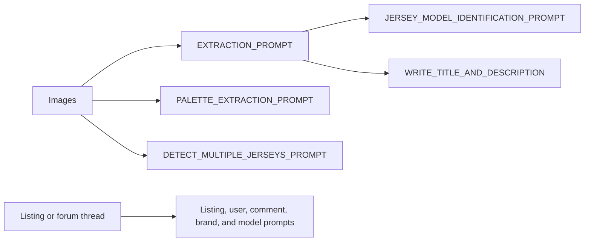

# Prompting

The scanner uses a small set of reusable prompts.
Each prompt has one job and one output shape.

## Core prompts

| Prompt | Used by | Purpose |
| --- | --- | --- |
| `CHECK_IF_PRODUCT_IN_FULL_FRAME_SYSTEM_PROMPT` | `check_if_full_frame` helper | Returns a Boolean for full-frame jersey gating. |
| `EXTRACTION_PROMPT` | `extract_basic_info` | Extracts brand, size, team, league, sport, and player. |
| `JERSEY_MODEL_IDENTIFICATION_PROMPT` | `_extract_jersey_model_sync` | Picks the model using extracted attributes and brand-specific instructions. |
| `WRITE_TITLE_AND_DESCRIPTION` | `_generate_title_and_description_sync` | Writes the listing title and description from extracted attributes. |
| `PALETTE_EXTRACTION_PROMPT` | `extract_color_palette` | Returns hex colors only. |
| `DETECT_MULTIPLE_JERSEYS_PROMPT` | `detect_multiple_jerseys` | Clusters a submission into one or more jerseys. |

## Insight prompts

| Prompt | Used by | Purpose |
| --- | --- | --- |
| `LISTING_INSIGHT_SYSTEM_PROMPT` | `extract_all_insights` | Extracts listing-level insights. |
| `USER_INSIGHT_SYSTEM_PROMPT` | `extract_all_insights` | Extracts user interests and expertise. |
| `COMMENT_INSIGHT_SYSTEM_PROMPT` | `extract_all_insights` | Extracts reusable comment-level insights. |
| `BRAND_INSIGHT_SYSTEM_PROMPT` | `extract_all_insights` | Extracts brand-level authenticity insights. |
| `MODEL_INSIGHT_SYSTEM_PROMPT` | `extract_all_insights` | Extracts model-level authenticity insights. |

## Brand instructions

`BRAND_INSTRUCTIONS_MAPPING` injects brand-specific model clues before model identification runs.

## Prompt flow

## Related pages

- [Vision models](/ai-jersey-scanner/vision-models)
- [Structured outputs](/ai-jersey-scanner/structured-outputs)
- [Evaluations](/ai-jersey-scanner/evaluations)
