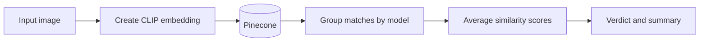

# Authentication Pipeline

## Request flow

1. The service receives an uploaded jersey image.
2. It converts the image into a CLIP embedding.
3. It queries Pinecone for the nearest reference images.
4. It groups the returned matches by `metadata.model`.
5. It averages the similarity scores per model.
6. It selects the highest-scoring model as the identified model.
7. It applies the confidence thresholds to build the verdict.
8. It returns `identified_model`, `auth_confidence`, `nearest_matches`, `summary`, and `verdict`.

## Verdict rules

- scores below the medium threshold return `uncertain`
- identified models containing `authentic` return `authentic`
- identified models containing `counterfeit` return `counterfeit`

## Reference data flow

- `scripts/setup_reference_data.py` scans `reference_images/`
- it writes `image_path`, `authenticity`, `model`, `model_name`, and `feature_type` metadata
- it upserts the vectors to Pinecone

## Output contract

| Field | Meaning |
| --- | --- |
| `identified_model` | The top-scoring model label |
| `auth_confidence` | The averaged similarity confidence |
| `nearest_matches` | The top Pinecone matches |
| `summary` | The human-readable result summary |
| `verdict` | The final authenticity verdict |

## See also

- [Authentication](/authentication)
- [Vision models](/ai-jersey-scanner/vision-models)
