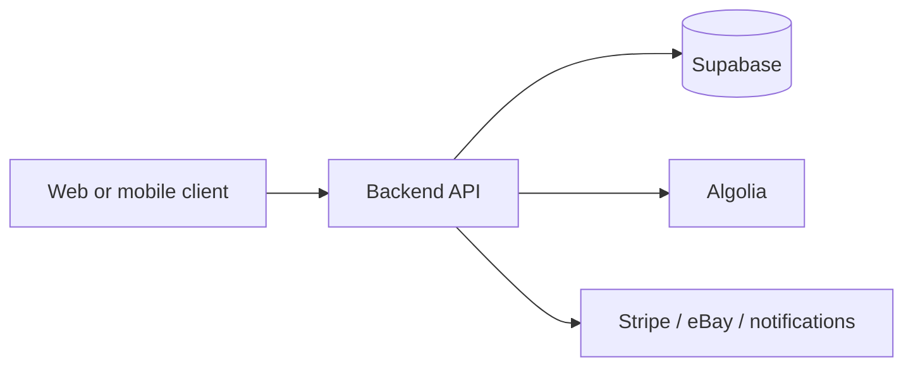
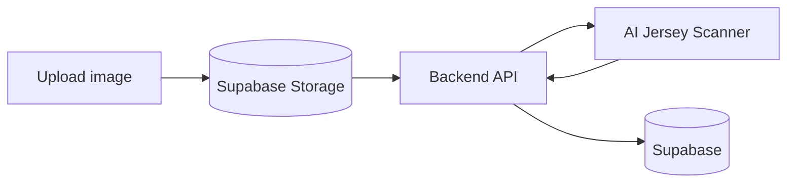
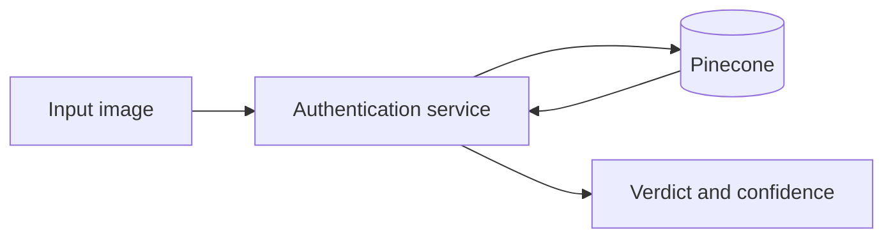

# Data Flow

## Browse and search

## Create a listing

## Image analysis

## Authenticity check

The platform stores the returned authenticity state in product and history records after the service responds.

## Why this matters

These flows make the platform easier to reason about:

- clients submit data
- the backend coordinates work
- persistence happens in Supabase
- search and AI systems derive secondary data

See also:

- [Image upload lifecycle](/image-upload-lifecycle)
- [Request lifecycle](/request-lifecycle)
- [AI Jersey Scanner](/ai-jersey-scanner)
- [Authentication](/authentication)
