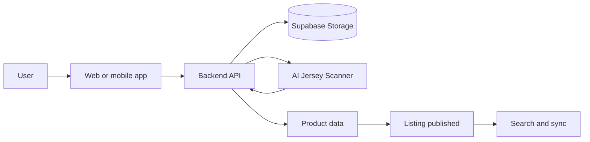
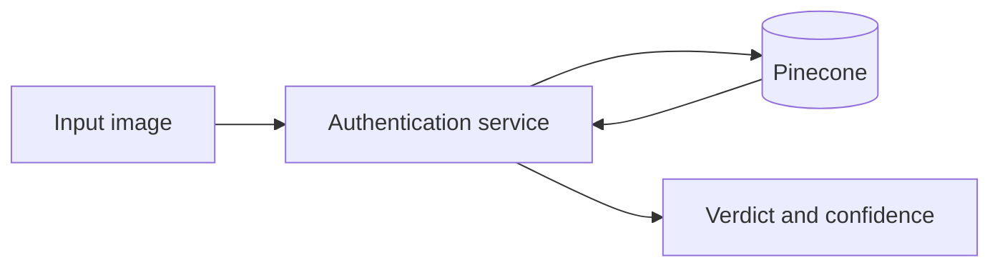
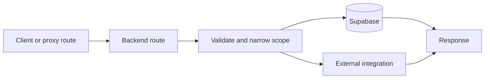
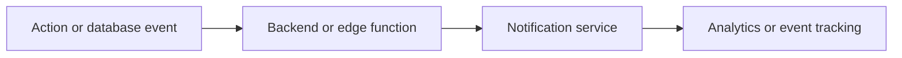
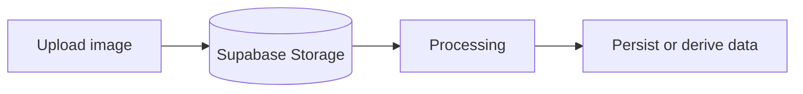

# Engineering Relationships

Use this page when you need to know what depends on what.
Only verified relationships appear here.

## Relationship rules

- Ownership flows from repository to application or service, then to APIs, data, and integrations.
- Dependencies are recorded only when the inventory or source confirms them.
- Scanner and authentication repositories appear in the graph now that their inventories are imported.

## Listing creation

Verified touchpoints:

- user uploads enter through web, mobile, or warehouse intake flows
- backend services create or update product records from scanner outputs
- the AI Jersey Scanner handles attribute extraction and listing generation
- Supabase storage holds uploaded objects
- derived search and sync systems consume the published result

## Authenticity verification

Verified touchpoints:

- the authentication service embeds an image and queries Pinecone
- the service returns the identified model, confidence, matches, summary, and verdict
- the main platform stores authenticity state in product and history records

## Request lifecycle

Verified touchpoints:

- web requests often proxy through backend helpers
- backend routes own the request contract and response shape
- database reads and writes happen through Supabase
- external integrations are called only after the route has validated scope

## Notification lifecycle

Verified notification surfaces include:

- Discord feedback and moderation notifications
- OneSignal mobile notifications
- Supabase edge functions for order, shipment, and transactional flows
- PostHog for analytics and instrumentation

## Image lifecycle

Verified image paths include:

- marketplace uploads
- scanner uploads
- warehouse intake photos
- background removal and image effects

See also:

- [Image upload lifecycle](/image-upload-lifecycle)
- [Data flow](/data-flow)
- [Backend integrations](/backend/integrations)
