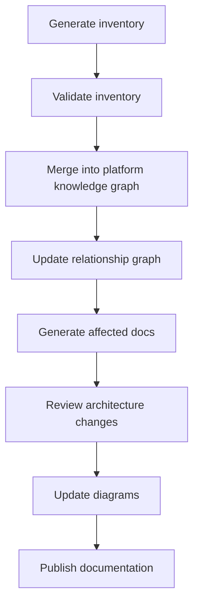

# Merge Strategy

Use this process when a repository is ready to enter the docs site.

## Steps

1. Generate engineering inventory.
2. Validate the inventory against source code and current docs.
3. Merge the inventory into the platform knowledge graph.
4. Update the relationship graph.
5. Generate affected documentation pages.
6. Review architecture changes and boundary shifts.
7. Update diagrams and links.
8. Publish the docs update.

## Rules

- Do not add repository detail before the inventory is verified.
- Keep future repositories out of the graph until their inventories are imported.
- Update the knowledge graph first, then the pages that point at it.
- Prefer one merge pass per repository so the diff stays reviewable.

## Output

Every merge should leave the docs site with:

- a current graph
- current relationship maps
- current ownership boundaries
- current integration registry entries
- current terminology
- current templates for the next change

See also:

- [Engineering knowledge](/engineering-knowledge)
- [Documentation standards](/engineering-knowledge/documentation-standards)
- [Repository map](/repository-map)
