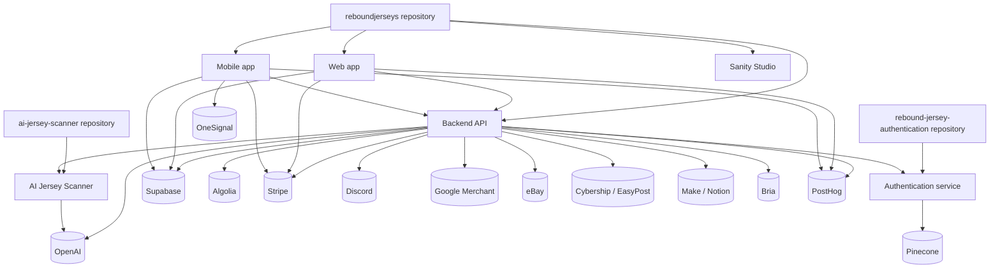

# Platform Knowledge Graph

This page records the verified nodes and edges that make up the current platform.
It is a summary of the inventory, not a replacement for it.

## Graph

## Verified nodes

| Type | Examples | Source |
| --- | --- | --- |
| Repository | `reboundjerseys`, `ai-jersey-scanner`, `rebound-jersey-authentication` | [Repository map](/repository-map) |
| Application | web app, mobile app, Sanity Studio | [Repository map](/repository-map) |
| Service | backend API, AI Jersey Scanner, Authentication service | [Service boundaries](/service-boundaries) |
| API | backend HTTP routes, scanner HTTP routes, auth HTTP route | [AI Jersey Scanner](/ai-jersey-scanner) and [Authentication](/authentication) |
| Database | Supabase Postgres, views, storage, edge functions | [Database overview](/database/overview) |
| Integration | Stripe, Supabase, Algolia, OpenAI, Pinecone, Discord, Google, eBay, Cybership, EasyPost, Make, Notion, Bria, PostHog, OneSignal | [External integrations](/reference/external-integrations) |

## Scope note

The scanner and authentication repositories now have their own sections in this site.
Keep this page focused on the current platform repository and link out instead of duplicating subsystem internals.

See also:

- [Repository map](/repository-map)
- [Service boundaries](/service-boundaries)
- [Engineering relationships](/engineering-knowledge/engineering-relationships)
- [Ownership boundaries](/engineering-knowledge/ownership-boundaries)
- [AI Jersey Scanner](/ai-jersey-scanner)
- [Authentication](/authentication)
