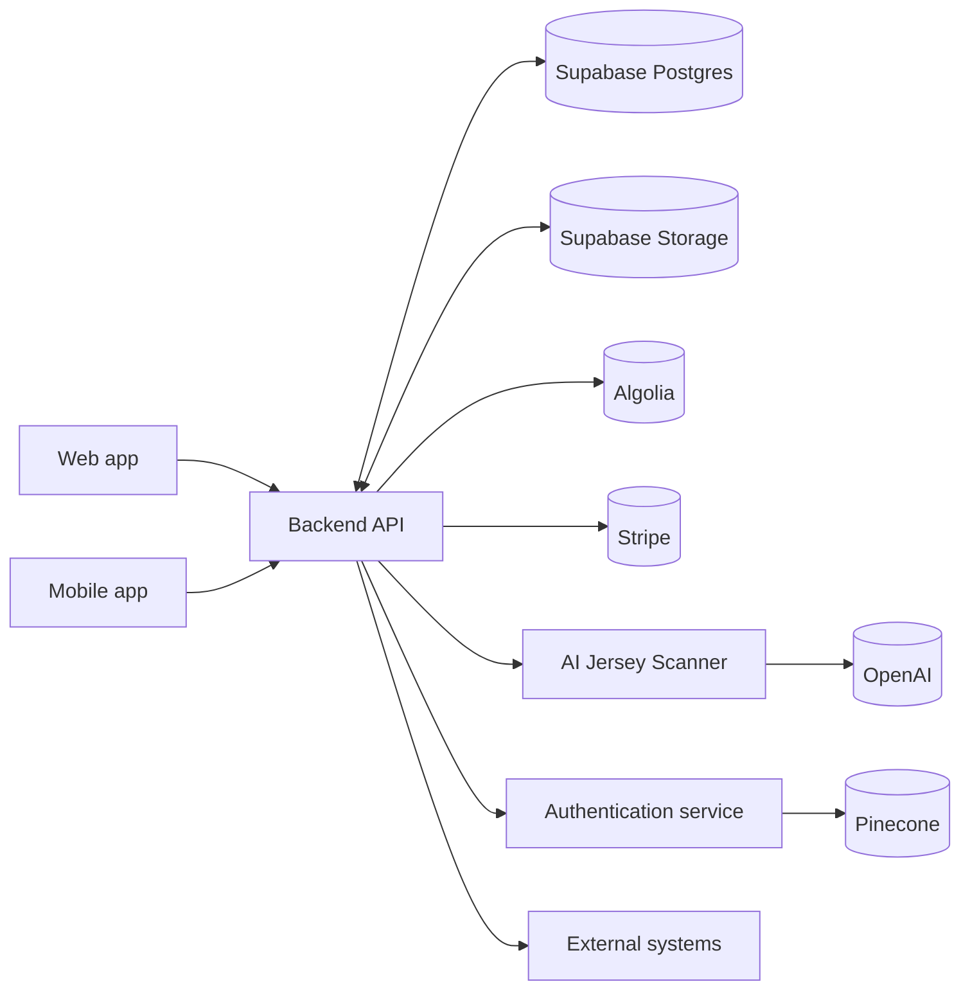

# High-level Architecture

## What this means

- Clients do not talk to the database directly for core workflows.
- The backend coordinates marketplace state, sync, moderation, and external service calls.
- Supabase stores the source data, file assets, and derived workflow state.
- Algolia stores the searchable marketplace index.
- Specialized AI work lives in dedicated scanner and authentication services outside the main repository boundary.

## Main code anchors

- `src/backend/server/server.ts`
- `src/backend/services/scanner/scannerService.ts`
- `src/backend/services/warehouseIntakeService.ts`
- `src/backend/routes/ebay.ts`
- `src/web/app`
- `src/frontend/app`

See also:

- [System architecture](/system-architecture)
- [Data flow](/data-flow)
- [Request lifecycle](/request-lifecycle)
- [AI Jersey Scanner](/ai-jersey-scanner)
- [Authentication](/authentication)
